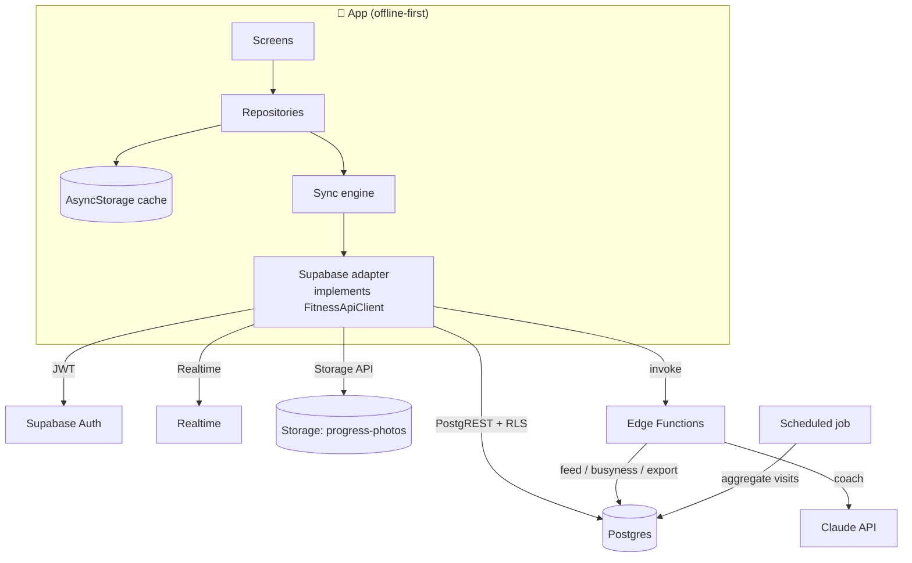

# Backend Design

This document specifies the backend for the fitness app. It is paired with two
concrete artifacts in this repo:

- **`src/api/`** — the shared TypeScript contract (DTOs, endpoint payloads, and
  the `FitnessApiClient` interface the app programs against).
- **`supabase/schema.sql`** — the reference Postgres schema, RLS policies, and
  triggers.

The app is **offline-first today** (everything in AsyncStorage). The backend
adds accounts, multi-device sync, social features, hosted AI, crowd-sourced gym
busyness, and daily-activity ingestion — **without changing the domain or UI
layers**. The per-domain repository (`src/data/*Repository.ts`) is the only seam
that changes.

---

## 1. Goals & non-goals

**Goals**

- Multi-device sync with a genuinely offline-first client (the app must stay
  fully usable with no network).
- A social layer (follows, feed, reactions, comments) with **per-record,
  per-domain privacy** the user controls.
- Hosted, cross-domain AI that can reason over strength + cardio + nutrition +
  recovery together.
- Crowd-sourced gym busyness that never leaks an individual's presence.
- Privacy and security as first-class constraints (see `SECURITY.md`).

**Non-goals (for v1 of the backend)**

- Real-time multiplayer / live workout co-op.
- A public web app (the contract is client-agnostic, so it's possible later).
- Self-hosting — we lean on managed infrastructure to stay small.

---

## 2. Why Supabase

Supabase gives us managed **Postgres + Auth + Realtime + Storage + Edge
Functions** with **row-level security (RLS)** as the enforcement layer. That
matches this app well:

- The data is **relational** (users, follows, posts, meals-with-ingredients) —
  Postgres models it naturally, unlike a document store.
- **RLS pushes authorization into the database**, so privacy rules are enforced
  in one place regardless of which client or query hits them. For an app whose
  headline promise is privacy, this is the single most valuable property.
- CRUD is **auto-exposed via PostgREST**, so most sync needs no bespoke server
  code — only the genuinely server-side logic (AI, feed assembly, busyness
  aggregation, data export) becomes an Edge Function.
- Managed **Storage** with per-user policies covers progress photos.

> Where a custom Node + Postgres API would differ: you'd hand-build auth,
> realtime, storage, and — crucially — reimplement the RLS guarantees as
> middleware on every route. The schema and the `src/api` contract here are
> deliberately vendor-neutral; only the *adapter* that implements
> `FitnessApiClient` is Supabase-specific.

---

## 3. Architecture



CRUD and realtime go straight to Postgres under RLS. Only cross-cutting logic
lives in Edge Functions.

---

## 4. Authentication

- **Supabase Auth** with email/password and OAuth (**Apple** — required for iOS
  App Store when offering third-party login — and **Google**).
- On sign-up, a trigger seeds a `profiles` row and a `privacy_settings` row
  (see `handle_new_user()` in the schema).
- The client stores the session in secure storage (`expo-secure-store`) and
  attaches the JWT to every request. `auth.uid()` is what every RLS policy keys
  on.
- Account deletion cascades (`on delete cascade` from `auth.users`) so a delete
  removes all owned rows; storage objects are purged by the delete Edge
  Function.

---

## 5. Data model

Full DDL is in **`supabase/schema.sql`**. Design choices worth calling out:

**Hybrid document + columns.** Training records (`workout_sessions`,
`activities`, `meals`) keep the full domain object in a `data jsonb` column and
*also* extract a few columns (`started_at`, `total_volume`, `distance_m`,
`calories`, …). This:

- matches the client's existing **document model**, so sync is whole-record and
  trivial (no shredding a session into rows and back);
- still supports **feed rendering, filtering, and leaderboards** via the
  extracted/indexed columns.

The alternative — fully normalizing sets/ingredients into child tables — is
better for heavy server-side analytics but adds sync and mapping complexity we
don't need yet. The `data` column can be normalized later without a client
change.

**Client-generated UUID ids.** Every synced row's `id` is a client-generated
**UUID v4**, which makes offline creates **idempotent** (re-pushing is a no-op
upsert) and avoids server round-trips to mint ids. → *Migration note:* the app
currently uses `createId()` (timestamp+counter); switch new records to
`crypto.randomUUID()` / a UUID polyfill before enabling sync. Existing local
ids can be migrated on first sync.

**Reference data.** The exercise catalog and food database ship in the app
(`src/domain/exercises.ts`, `foods.ts`). Server-side seed tables can mirror them
later so they're updatable without an app release; until then the client copy is
canonical.

Tables map 1:1 to `src/api/rows.ts` (snake_case ↔ camelCase in the adapter).

---

## 6. Privacy & RLS

RLS is **deny-by-default**: every table enables it and only the listed policies
grant access.

- **Owner policies** — `user_id = auth.uid()` for full CRUD on your own rows.
- **Shared-read policies** — on `workout_sessions`, `activities`, `meals`,
  `feed_posts`: a row is readable by others only when `visibility = 'public'`,
  or `visibility = 'followers'` **and** the viewer is an accepted follower
  (`is_follower()`).
- **Always-private tables** — `progress_photos`, `gyms`, `gym_visits`,
  `daily_activity`: owner-only, no shared-read policy exists. Photos are shared
  only by explicitly creating a `feed_posts` row that references them.
- **Privacy settings** give per-domain defaults (`share_workouts`, …) and a
  `default_visibility`; individual records can still override. "Hide" is just
  setting a record's `visibility` back to `private` (or deleting its post),
  which the shared-read policy immediately respects.

Because these live in the database, a bug in a client query can't leak data —
the row simply won't be returned.

---

## 7. Offline-first sync

The client remains the source of truth for the current session; the server is
the merge point across devices.

**Model:** last-write-wins per record, keyed on `updated_at`, with **soft
deletes** (`deleted_at` tombstones) so deletions propagate.

**Pull** (`SyncPullRequest`): `select * from <table> where updated_at > :since`
across the synced tables, ordered by `updated_at`, paged by a cursor. The client
stores the returned `cursor` as the next `since`.

**Push** (`SyncPushRequest`): upsert locally-dirty rows by `id`. The server
keeps the row with the newer `updated_at`; losers come back in `conflicts`. A
DB trigger (`set_updated_at`) makes the server's timestamp authoritative.

**Live updates:** subscribe via **Supabase Realtime** to the user's own rows and
to `feed_posts`/`post_reactions` for people they follow, so the feed and
multi-device edits update without polling.

**Conflict policy:** LWW is sufficient because records are user-owned and rarely
edited concurrently. The one exception — editing the same meal on two offline
devices — resolves to the later `updated_at`; acceptable for this domain. (A
field-level merge or CRDT is possible later but is overkill now.)

Most of this needs **no server code** — it's PostgREST + Realtime. A thin `sync`
Edge Function is optional if we want to batch multiple tables into one call.

---

## 8. Storage — progress photos

- Private bucket `progress-photos`, objects at `{user_id}/{photo_id}.jpg`.
- Storage RLS restricts read/write to the owning prefix (`storage.foldername`).
- Photos are **already EXIF/GPS-stripped client-side** (see `src/services/
  photos.ts`); the server never receives location metadata.
- Viewing uses **short-lived signed URLs** (`signedPhotoUrl`); no photo is
  public. Sharing a photo into the feed generates a signed URL per view, not a
  permanent public link.

---

## 9. Social features

- **Follows** (`follows`): edges with `status` (`accepted` immediately for
  public accounts; `pending` for private accounts until the followee accepts).
- **Feed** (`feed_posts`): a post references an underlying record
  (`kind` + `ref_id`) rather than duplicating it, so privacy stays consistent
  with the source. The **`getFeed`** Edge Function assembles hydrated
  `FeedItem`s (author card + pre-rendered summary + reaction rollup) so the
  client renders without N+1 fetches.
- **Reactions & comments** with straightforward owner-write / public-read
  policies (comments capped at 500 chars in the DB).
- **Granular control:** users choose what to share (per-domain defaults +
  per-record visibility). Nothing is shared by default — every visibility
  column defaults to `private`/`followers`, never `public`.

---

## 10. Hosted AI coach (cross-domain)

The app already has a transparent, rule-based coach on-device. The backend adds
an **LLM-backed** coach for open-ended and genuinely cross-domain questions
("did yesterday's long run affect today's squat readiness?").

- **`coach` Edge Function** (`CoachRequest` → `CoachResponse`). The function
  runs as the user (RLS-scoped) to gather only that user's recent
  strength/cardio/nutrition/recovery rows, builds a compact context, and calls
  the **Claude API** (`claude-opus-4-8` / latest) with the model key held in
  Edge Function secrets — **never on the client**.
- **Grounding & transparency:** the response lists `usedContext` (what data it
  was based on), mirroring the app's "no black box" principle.
- **Graceful degradation:** if the model is unavailable, `degraded: true` tells
  the client to fall back to the on-device rule-based engine — so the coach
  never hard-fails.
- **Cost control:** cache per-scope responses briefly; rate-limit per user.
- **Privacy:** only the requesting user's own data is ever sent, and only for
  the domains they opt into via `includeDomains`.

---

## 11. Gym busyness (crowd-aggregated, anonymized)

- Each user's `gyms` get a shared `place_id` (derived from a **geohash** of the
  coordinates) so many users' saved gyms for the same location roll up together.
- A **scheduled Edge Function** aggregates `gym_visits` into `gym_busyness`
  (`place_id × day_of_week × hour → score`).
- **k-anonymity:** a slot is only written/exposed when at least **K distinct
  users** contributed (`contributors >= K`, e.g. K=5). Below the floor the slot
  stays `unknown`, so no individual's presence at a gym can be inferred.
- `gym_busyness` is read-only to clients; only the aggregation job (service
  role) writes it. The single-user heatmap already in the app
  (`src/domain/gym/busyness.ts`) remains the fallback when crowd data is thin.

---

## 12. Daily activity (HealthKit / Google Fit)

- Steps and active energy are read **on-device** (HealthKit on iOS, Google Fit /
  Health Connect on Android) and written to `daily_activity` (one row per user
  per day per source), then synced like any other table.
- This is the one deferred client feature that needs a **native module and a dev
  build** (it can't run in Expo Go), which is why it pairs with the backend
  phase.
- Once present, steps feed the readiness score and daily goals server-side too.

---

## 13. Security checklist

- **RLS on every table, deny-by-default.** No table is readable without a policy.
- **JWT auth**; `auth.uid()` is the sole trust anchor for policies.
- **Server-side validation** in Edge Functions — the client's input
  sanitization (`src/lib/sanitize.ts`) is defense-in-depth, not the boundary.
- **Secrets** (LLM key, service role) live only in Edge Function env; never
  shipped to the client.
- **Signed URLs** for photos with short expiry; private bucket.
- **PII minimization**: gym coordinates stay private; busyness is anonymized
  with a k-anonymity floor; location never leaves the device except as a saved
  gym the user created.
- **Rate limiting** on Edge Functions (per-user + per-IP) to protect the LLM
  budget and prevent scraping of public profiles.
- **GDPR/CCPA**: `exportMyData` returns a signed archive; `deleteMyAccount`
  cascades all rows and purges storage.
- **Abuse**: comment length capped in-DB; report/block is a fast follow on the
  social layer.

---

## 14. Client integration

The app's repositories are the seam. Today:

```
UI → useStore/useCardio/… → repository → AsyncStorage
```

With the backend, the repository gains a sync engine that wraps the same local
cache and an implementation of `FitnessApiClient`:

```
UI → store → repository → AsyncStorage (read/write, unchanged)
                        ↘ sync engine → SupabaseApiClient (push/pull, realtime)
```

- **No domain or UI change.** `src/api` is a pure contract; the Supabase SDK is
  imported only inside `SupabaseApiClient` (one adapter file), so the rest of
  the app never depends on the vendor.
- Reads stay local-first (instant, offline); writes update the cache and enqueue
  a push. Realtime and pull reconcile in the background.
- Auth adds a thin gate in front of the tab navigator; the app stays fully
  functional signed-out in a local-only mode (sync simply disabled).

---

## 15. Phased rollout

| Phase | Scope | Notable pieces |
|------|-------|----------------|
| **0** | Auth + profiles + **cloud sync/backup** of existing domains (single user, multi-device). No social. | Auth, `profiles`, sync engine, UUID id migration |
| **1** | **Social**: follows, feed, reactions, comments, privacy controls. | `follows`, `feed_posts`, `getFeed`, Realtime |
| **2** | **Hosted AI coach** (cross-domain) with on-device fallback. | `coach` Edge Function + Claude |
| **3** | **Gym busyness** crowd aggregation. | geohash `place_id`, scheduled job, k-anonymity |
| **4** | **Daily activity** ingestion (HealthKit / Google Fit) via a dev build. | native health module, `daily_activity` |

Each phase is independently shippable and leaves the app fully working offline.

---

## 16. Cost & ops

- Start on Supabase's free/Pro tier; the heaviest cost driver is the **LLM
  coach** — mitigated by caching, rate limits, and the on-device fallback.
- Storage cost scales with progress photos; the client already downsizes to
  1080px on import.
- Observability: Supabase logs + a lightweight error reporter in the app.

---

## 17. Open decisions

- **K value** for busyness anonymity (start K=5; tune with real density).
- **Private vs public accounts by default** (recommend public-but-nothing-shared:
  discoverable, but every record starts private).
- **Feed ranking** (chronological first; add ranking only if needed).
- **Which LLM tier** for the coach per scope (cheap model for short scopes,
  larger for freeform).
